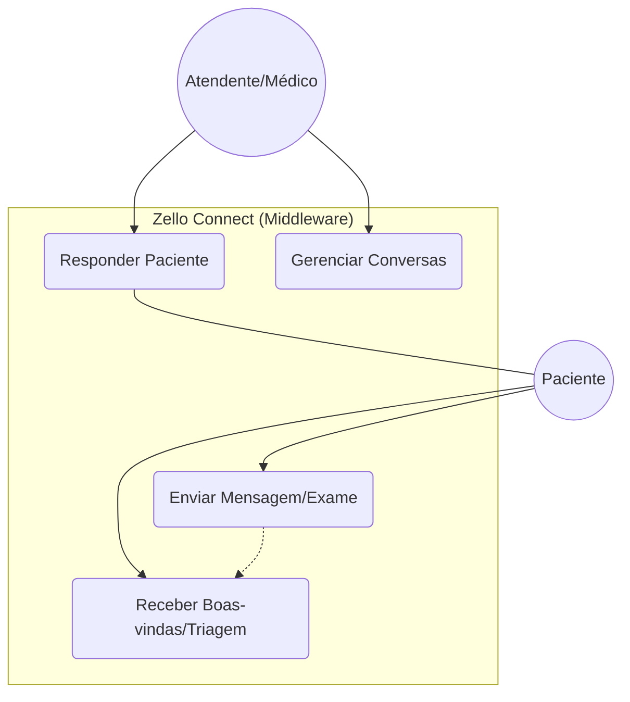
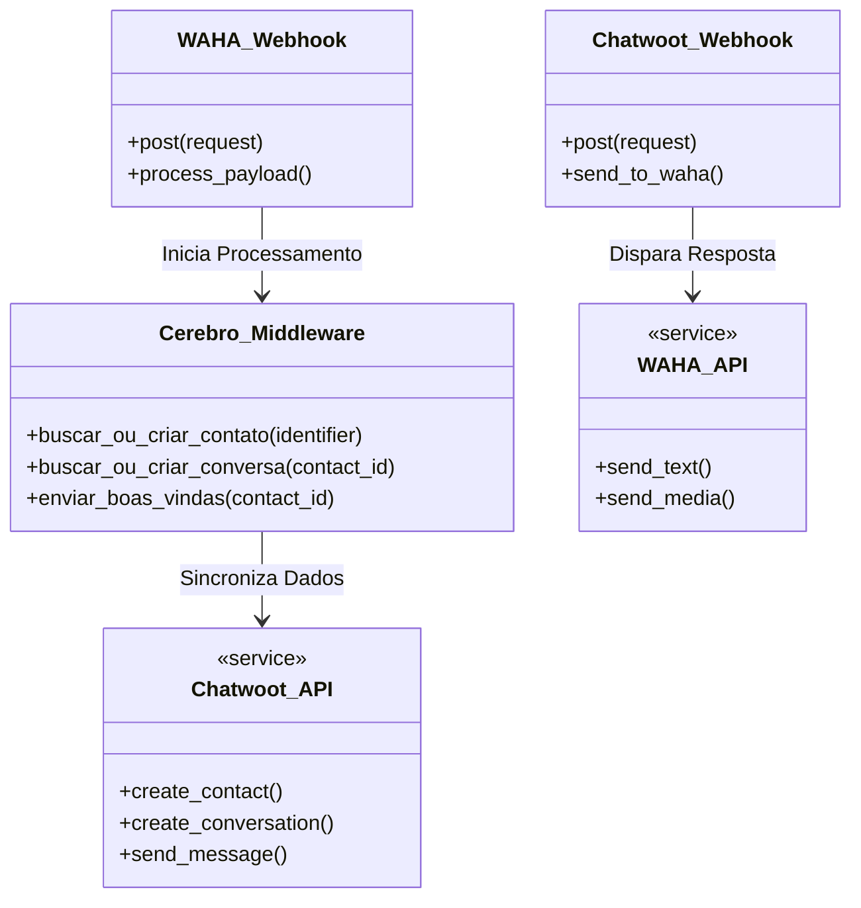

# Zello Connect 🚀

O **Zello Connect** é um middleware de alto desempenho desenvolvido em **Django** para integrar de forma dinâmica o **WAHA** (WhatsApp HTTP API) ao **Chatwoot** (Plataforma de Atendimento Open-source). 

Este projeto é um **MVP (Minimum Viable Product)** desenvolvido por alunos do último semestre do **Técnico em Desenvolvimento de Sistemas**. O objetivo é oferecer uma solução de TI robusta para hospitais, com foco em democratizar o acesso à saúde para pessoas idosas, com baixo letramento ou dificuldades motoras.

---

## 📌 Visão Geral da Arquitetura

O sistema funciona como um "Cérebro" de roteamento entre o paciente (WhatsApp) e o atendente (Chatwoot), garantindo que cada conversa chegue ao lugar certo sem intervenção manual inicial.

### Fluxo de Caso de Uso
Abaixo, o diagrama que ilustra as interações dos usuários com o sistema:

### Estrutura Lógica (Diagrama de Classes)
O middleware gerencia a lógica de negócio e a comunicação entre as APIs externas:

---

## 🛠️ Stack Tecnológica

* **Linguagem & Framework:** Python 3.10+ e Django.
* **Integração de Mensageria:** WAHA (WhatsApp HTTP API) rodando em ambiente Docker.
* **Gestão de Atendimento:** API do Chatwoot (CRM e Plataforma Multicanal).
* **Segurança:** Implementação de variáveis de ambiente (`python-dotenv`) para proteção de tokens e credenciais.
* **Infraestrutura de Testes:** Ngrok para tunelamento de Webhooks locais.

---

## ♿ Foco em Acessibilidade e Inclusão

O diferencial técnico deste MVP é a preparação para atender perfis com dificuldades tecnológicas:
- [x] **Gestão de Identificadores (LID):** Suporte total a dispositivos vinculados e números business, garantindo que o paciente receba a resposta independente do dispositivo.
- [x] **Interface Simplificada:** O paciente utiliza apenas o WhatsApp, sem necessidade de novos aplicativos.
- [ ] **Próxima Fase - Acessibilidade Assistida:** Transcrição de áudio e leitura de exames via IA.

---

## 🚀 Guia de Instalação Rápida

1.  **Clonar repositório:** `git clone https://github.com/Vandamelloz/zello-connect.git`
2.  **Ambiente Virtual:** `python -m venv .env && source .env/bin/activate`
3.  **Dependências:** `pip install django requests python-dotenv`
4.  **Configuração:** Criar arquivo `.env` com `CHATWOOT_API_TOKEN`, `CHATWOOT_ACCOUNT_ID` e `CHATWOOT_INBOX_ID`.
5.  **Executar:** `python manage.py runserver`

---

## 🔒 Segurança e Boas Práticas
* **Proteção de Dados:** O arquivo `.env` está devidamente listado no `.gitignore` para evitar vazamento de credenciais.
* **Clean Code:** Lógica de middleware modularizada para facilitar a manutenção e escalabilidade.

---

**Desenvolvido por:**
* Débora de Jesus
* Hebert Viana
* Vanderléia Mello

*Alunos formandos do curso Técnico em Desenvolvimento de Sistemas do SENAI Vitória da Conquista.* 💻🏥
